# IBM-Cloud-Internet-Services-

En ste repositorio encontrará el detalle de la implementación de IBM Cloud Internet Services con una aplicación desplegada en dos VSI on VPC para alta disponibilidad y cuyo tráfico es gestionado por un Balanceador de Carga. También encontrará el paso a paso de la configuración de los diferentes servicios de Internet services para la seguridad de la aplicación web.

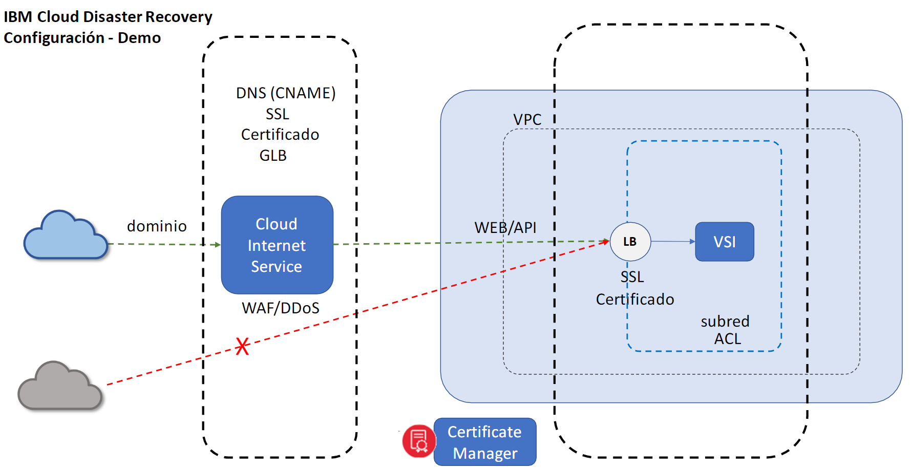

### Indice:
1. [Configuración del dominio](#1-acceso-a-skytap-on-ibm-cloud)
2. [Configuración de acceso a la aplicación](#2-preparar-imagen-de-la-máquina-power-aix)
3. [Certificado SSL](#3-crear-un-trabajo-de-importación-en-skytap)
4. [Certificado de origen](#4-cargar-los-archivos-vía-ftp)
5. [Protección contra ataques DDoS](#5-inicio-del-proceso-de-análisis-e-importación)
6. [Reglas de firewall]()
7. [Edge Functions]()
8. [Referencias](#referencias-)

## Prerrequisitos 🛑

Para esta Demo se requiere de conocimiento básico de DNS y redes.
Además de esto se requiere tener aprovisionado:
- [VPC.](https://cloud.ibm.com/docs/vpc?topic=vpc-getting-started)
- 2 [Instancias en la VPC](https://cloud.ibm.com/docs/vpc?topic=vpc-vsi_best_practices) con un servicion web configurado en ella.
- Configurar cada instancia como servidor de una misma aplicación
- [Listas de control de accesos](https://cloud.ibm.com/docs/vpc?topic=vpc-using-acls)

## Contenido 📋
**_Instrucciones_**
Esta demo se divide en 4 factores importantes las cuales son:
- **Configuración de dominio y hostname**
- **Configuración de acceso al dominio**
- **Certificado SSL**

Las diferentes configuraciones de esta demo se gestionan en diferentes servicios como **Cloud Internet Services**, **Virtual Private Cloud**, **Certificate Manager** e incluso la herramienta de **Access IAM**

## Comenzando 🚀

### 1. Configuración del dominio

**Cloud Internet Services**

Para empezar, se debe crear un servicio de Internet Services, siguiendo las instrucciones del siguiente enlace:
- [Iniciación a IBM Cloud Internet Services](https://cloud.ibm.com/docs/cis?topic=cis-getting-started)

Luego de ello debe configurar un DNS reservado en el Internet Services creado previamente de la siguiente manera:
- Si ya se tiene un DNS reservado debe copiar los NS (Name Servers) y configurarlos dentro de Internet Services. Los NS tienen la siguiente estructura **ns#.provider.com**. Si tiene más de una deberá configurarlo en Internet Services como se muestra a continuación:
    1. Ingrese a la herramienta de Internet Services creada. Le va a aparecer el siguiente Dashboard:
    
    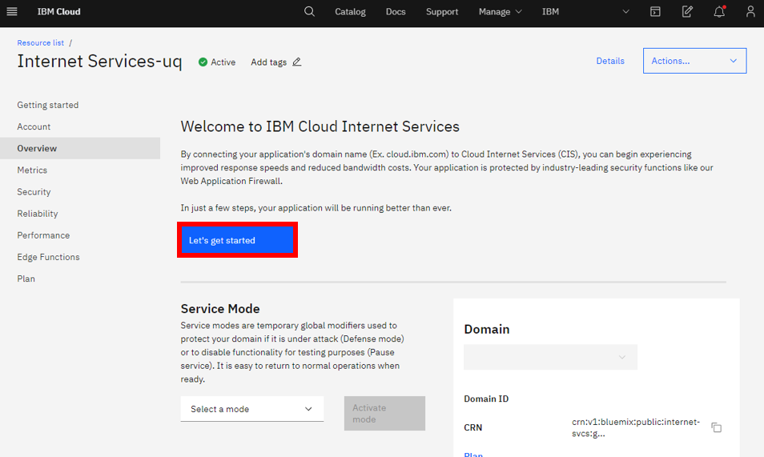 

    2. Al clickear en **Let´s start** aparecerá una pesataña lateral para conectar el dominio, configurar DNS record y delegar gestión del dominio, como se muestra a continuación:

    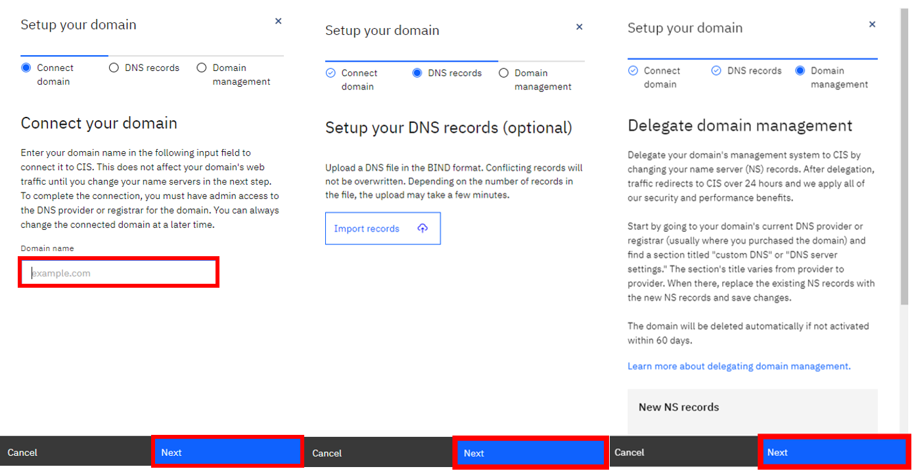 

    Una vez configurado el DNS reservado en la herramienta de Internet Service el estado del dominió aparecerá **pending** como se observa en la siguiente imagen:

    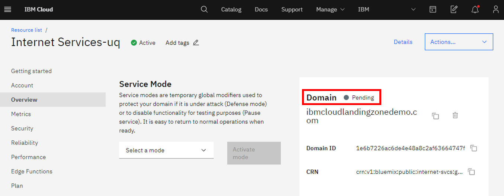 

    3. Para dejar el estado del dominio en Internet Services activo se debe configurar los **NS** antes mencionados en los records de Internet Services. Para ello, se debe dirigir a la pestaña de **Reliability** en la opción de **DNS**. Una vez allí, en la parte inferior de la ventana se encontraran los **Records** donde se configurarán los **NS**

    Se debe llenar cada uno de los campos de **DNS Records** de la siguiente manera:
     - Type: NS
     - Name: @
     - TTL: Automatic
     - Name Server: **ns´s del DNS reservado**

    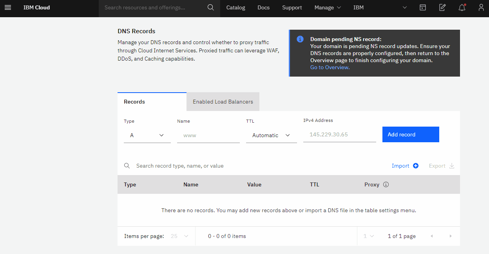 

    Una vez configurados los **Name Server** la conexión entre el DNS y el Internet Services tomará hasta 24 horas.

**VPC hostname - Load Balancer**

Para la configuración del hostname a la aplicación distribuida en las VSI´s, se requiere de la creación de un Load balancer para asignarle un único hostname a la aplicación.
Para aprovisionar el Load Balancer se debe dirigir al **VPC Infrastructure** en el menú principal de IBM Cloud y una vez allí debe ingresar al dashboard del Load balancer seleccionando **Load Balancer** en el menu de herramientas de VPC como se observa el la siguiente imagen:

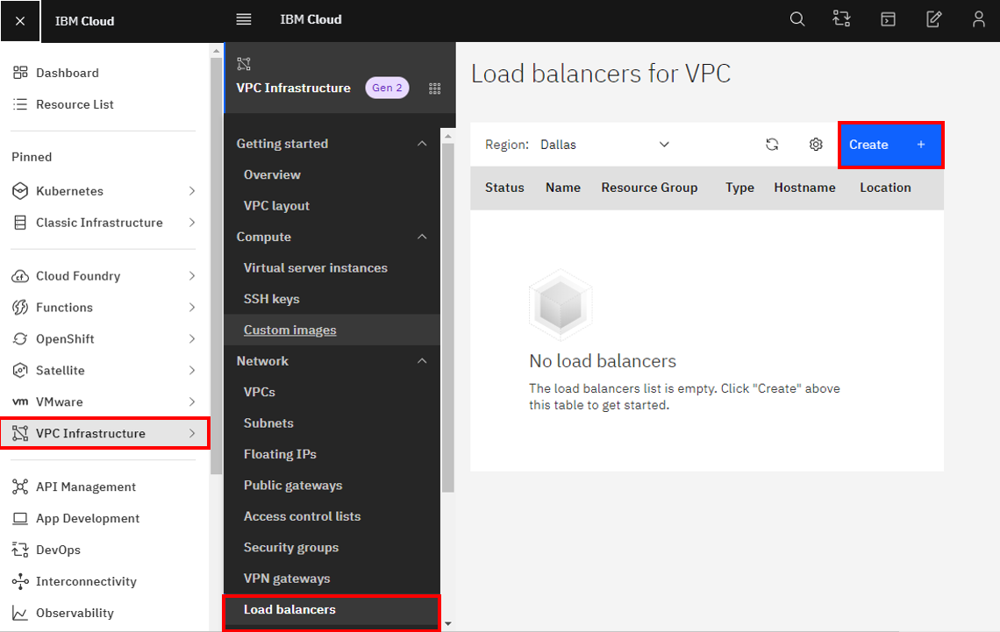 

Una vez allí se procede a crear el load balancer como se observa a continuación:

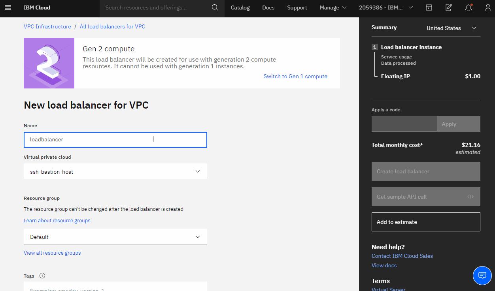 

Al crearse el load balancer se podrá obserar en el dashboard el cual mostrará las caracteristicas del mismo como son:
- Status
- Name
- Resource Group
- Hostname
- Location

Como se muestra a continuación:

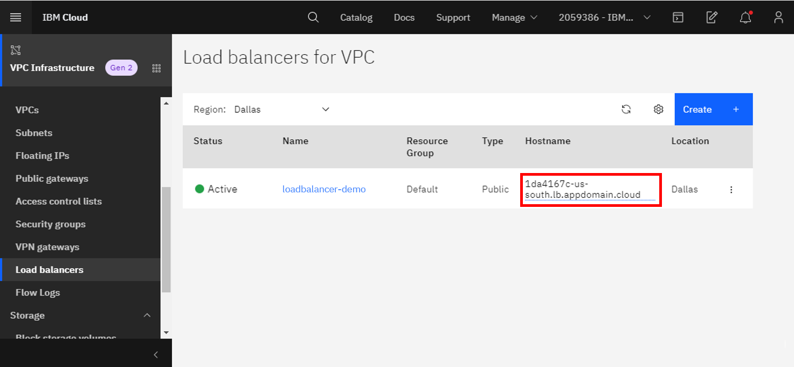 

**Load balancer - Hostname DNS Record**

Para que vincular su dominio personalizado a la aplicación que se está configurando aguregue un registro CNAME que apunte al Host name del Load Balancer y active el proxy, de la siguiente manera:

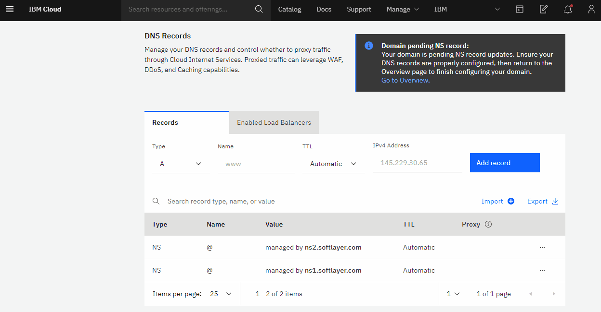 

### 2. Configuración de acceso a la aplicación 🔧

Esta configuración se limita el acceso a la aplicación mediante la creación de una ACL, permitiendo la comunicación al Load Balancer únicamente desde la instancia de Internet Services. Para esta configuración siga los pasos a continuación:

1. Ingrese en las lista de VPC´s dentro de la página de IBM Cloud, allí encontrará el nombre de su VPC con la ACL y grupo de seguridad asociados de forma predeterminada, ingrese a la ACL dando click sobre su nombre.

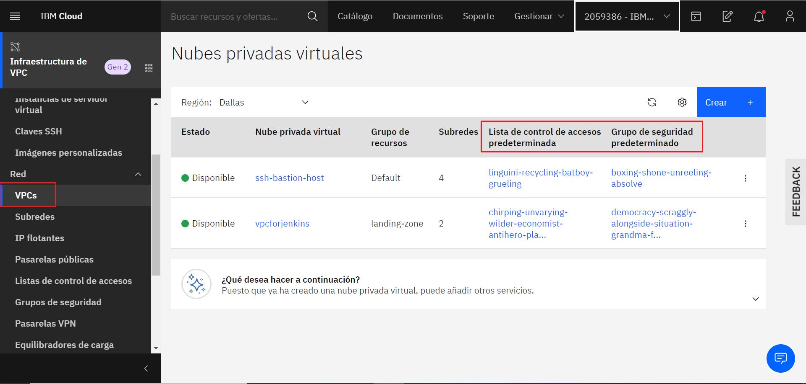 

2. Por defecto la ACL deniega todo el tráfico, por lo que en este paso solo necesitará agregar reglas que permitan el tráfico proveniente de Internet Services. [En este link ](https://api.cis.cloud.ibm.com/v1/ips) encontrará la API que enumera todas las direcciones IP utilizadas por el proxy de CIS. El proxy de CIS utiliza solo direcciones de esta lista, tanto para la comunicación de cliente a proxy como de proxy a origen. Agregue una regla para cada uno de estos rangos de IP´s seleccionando: **Crear**, en protocolos seleccione **Todos**, luego seleccione **CI o CIDR** y pegue la IP, en destino seleccione **Cualquiera** y para finalizar guarde los cambios.

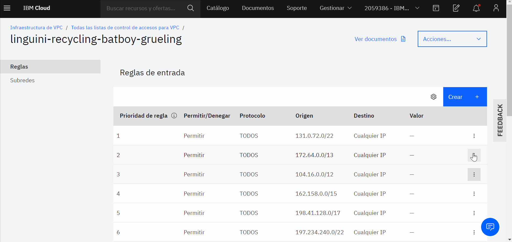 

### 3. Certificado SSL 🛡️

En esta parte del repositorio se enumerar los pasos para solicitar y configurar el certificado SSL para nuestro dominio, con el fin de cifrar los datos en tránsito.

1. Cree una instancia de IBM Cloud Certificate Manager para gestionar los certificados SSL, tendrá que elegir un nombre único, una ubicación soportada y un grupo de recursos.

2. Cree una autorización que proporcione al balanceador de carga de VPC acceso a la instancia de Certificate Manager. Para esto ingrese en **Gestionar** -> **Acceso (IAM)** -> **Autorizaciones** pulse **Crear** y seleccione **Servicio de infraestructura** como servicio de origen, elija **Equilibrador de carga para VPC** como tipo de recurso, seleccione su instancia en **instancia de servicio de origen**, ponga **Gestor de certificados** como servicio de destino, elija su instancia en **instancia de servicio de destino** y finalmente asigne el rol de acceso al servicio de **Escritor**.

3. Cree una segunda autorización que proporcione al certificate manager acceso a la instancia de Internet Services y así poder solicitar el certificado para su dominio. Para esto seleccione **Certificate manager** como servicio de origen, elija su instancia en **instancia de servicio de origen**, luego seleccione **Internet Servicess** como servicio de destino, elija su instancia en **instancia de servicio de destino** y finalmente asigne el rol de acceso al servicio de **Manager**.

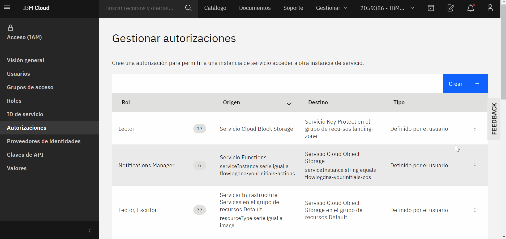 

### 4. Certificado de origen
### 5. Protección contra ataques DDoS
### 6. Reglas de firewall
### 7. Edge Functions
### 8. Referencias

#### Autores: IBM Cloud Tech Sales
