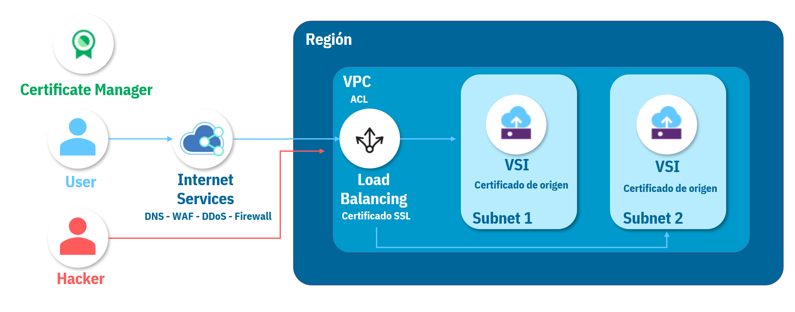
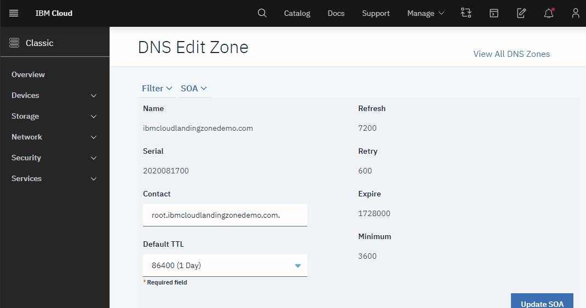
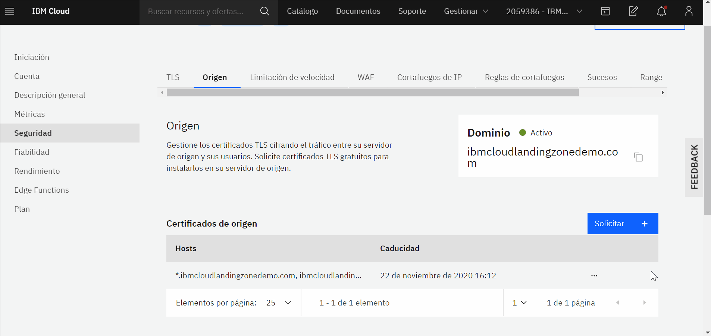
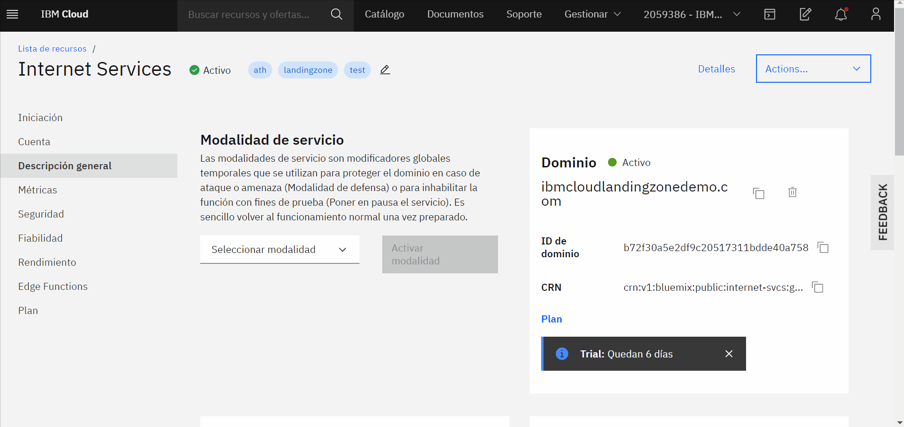
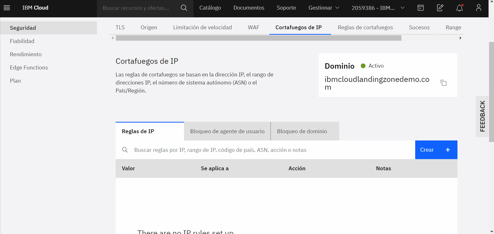
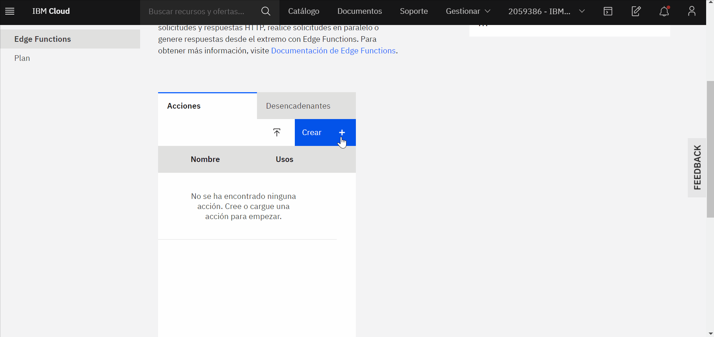
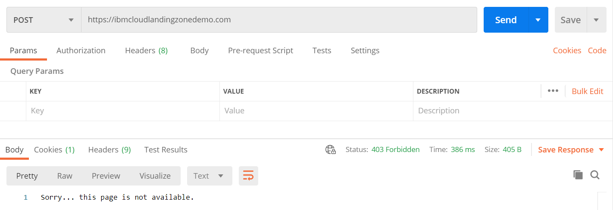

# IBM Cloud Internet Services

En ste repositorio encontrará el detalle de la implementación de IBM Cloud Internet Services con una aplicación desplegada en dos VSI on VPC para alta disponibilidad y cuyo tráfico es gestionado por un Balanceador de Carga. También encontrará el paso a paso de la configuración de los diferentes servicios de Internet services para la seguridad de la aplicación web.



## Contenido:
1. [Configuración del dominio](#1-acceso-a-skytap-on-ibm-cloud)
2. [Configuración de acceso a la aplicación](#2-preparar-imagen-de-la-máquina-power-aix)
3. [Certificado SSL](#3-crear-un-trabajo-de-importación-en-skytap)
4. [Certificado de origen](#4-cargar-los-archivos-vía-ftp)
5. [Protección contra ataques DDoS](#5-inicio-del-proceso-de-análisis-e-importación)
6. [Reglas de firewall]()
7. [Edge Functions]()
8. [Referencias](#referencias-)

## Prerrequisitos 

Para esta Demo se requiere de conocimiento básico de DNS y redes.
Además de esto se requiere tener aprovisionado:
- Instancia de [VPC.](https://cloud.ibm.com/docs/vpc?topic=vpc-getting-started)
- 2 VSI en VPC [VPC](https://cloud.ibm.com/docs/vpc?topic=vpc-vsi_best_practices) con un servicion web configurado en ella.
- Configurar cada instancia como servidor de una misma aplicación.

Las diferentes configuraciones de esta guía se gestionan en servicios como **Cloud Internet Services**, **Virtual Private Cloud**, **Certificate Manager** e incluso la herramienta de **Access IAM**.

## 1. Configuración del dominio :computer:

Para empezar, se debe crear un servicio de Internet Services, siguiendo las instrucciones del siguiente enlace:
- [Iniciación a IBM Cloud Internet Services](https://cloud.ibm.com/docs/cis?topic=cis-getting-started)

    1. Ingrese a la herramienta de Internet Services creada. Le va a aparecer el dashboard de la pestaña **overview** donde encontrará un boton **Lest´s start** para empezar con la configuración de Internet Services.

    2. Al dar click en **Let´s start** aparecerá una pestaña lateral para conectar el dominio, configurar DNS record y delegar gestión del dominio, como se muestra a continuación:

         
        
    3. En la pestaña **Connect your domain** se agregará el dominio reservado que posee, sin embargo, no se verá afectado el trafico de dicho dominio hasta cambiar los Name Servers como se muestra en el siguiente paso.
    
    4. En la configuración **Setup your DNS records** debe importar el **record** de su dominio el cual encontrará en su proveedor DNS. En caso de haber solicitado el dominio en IBM Cloud, el record se encuentra y se importa como se muestra a continuación:

         

    5. Después, se configurará en el proveedor de DNS, los NS que entrega el Internet Services en la configuración de **Delegate domain mangement**. Copie lo NS y agreguelos en el **Domain Registration** de su proveedor de DNS. Si el proveedor es IBM Cloud diríjase a **Classic Infrastructure > Services > Domain Registration**, allí encontrará su dominio y en él la opción **Add/Edit NS** donde podrá agregar hasta 5 **Name Servers (NS)**
   
Una vez configurado el DNS reservado en la herramienta de Internet Service, el estado del dominió aparecerá **pending**, esto se debe a que la configuración del dominio puede tomar hasta 24 horas.

**VPC hostname - Load Balancer**

En esta guía los servidores estan conectados a un Load Balancer y el usuario accede a la aplicación mediante su Host name. Para dirigir el tráfico a Internet Services y que este añada una capa de seguridad antes de que el tráfico pase por el Load Balancer y llegue a sus servidores, siga los pasos:

1. Aprovisione el Load Balancer, para esto se debe dirigir a **VPC Infrastructure** en el menú principal de IBM Cloud y una vez allí debe ingresar al dashboard del Load balancer seleccionando **Load Balancer** en el menú de herramientas de VPC como se observa el la siguiente imagen:

 

Una vez allí se procede a crear el load balancer como se observa a continuación:

 

Al crearse el load balancer se podrá obserar en el dashboard el cual mostrará las caracteristicas del mismo como son:

- Status
- Name
- Resource Group
- Hostname
- Location

 

**Load balancer - Hostname DNS Record**

Para vincular su dominio personalizado a la aplicación que se está configurando agregue un registro CNAME que apunte al Host name del Load Balancer y active el proxy.

Se debe llenar cada uno de los campos de **DNS Records** de la siguiente manera:

- Type: CNAME
- Name: @
- TTL: Automatic
- Name Server: **hostname del load balancer**

 

Luego de configurar el **hostname del Load Balancer** como link de acceso, podrá ingresar a la aplicación viculada al mismo desde el Dominio vinculado al **Internet Services** 

## 2. Configuración de acceso a la aplicación 🚦

Esta configuración limita el acceso a la aplicación mediante la creación de una ACL, permitiendo la comunicación al Load Balancer únicamente desde la instancia de Internet Services. Para esta configuración siga los pasos a continuación:

1. Ingrese a la lista de VPC´s dentro de la página de IBM Cloud, allí encontrará el nombre de su VPC junto con la ACL y grupo de seguridad asociados de forma predeterminada, ingrese a la ACL dando click sobre su nombre.

2. Por defecto la ACL deniega todo el tráfico, por lo que en este paso solo necesitará agregar reglas que permitan el tráfico proveniente de Internet Services. [En este link ](https://api.cis.cloud.ibm.com/v1/ips) encontrará la API que enumera todas las direcciones IP utilizadas por el proxy de CIS. El proxy de CIS utiliza solo direcciones de esta lista, tanto para la comunicación de cliente a proxy como de proxy a origen. Agregue una regla para cada uno de estos rangos de IP´s seleccionando: **Crear**, en protocolos seleccione **Todos**, luego seleccione **CI o CIDR** y pegue la IP, en destino seleccione **Cualquiera** y para finalizar guarde los cambios.

 

## 3. Certificado SSL 🛡️

En esta parte del repositorio se enumeran los pasos para solicitar y configurar el certificado SSL para nuestro dominio, con el fin de cifrar los datos en tránsito.

1. Cree una instancia de IBM Cloud Certificate Manager para gestionar los certificados SSL, tendrá que elegir un nombre único, una ubicación soportada y un grupo de recursos.

2. Cree una autorización que proporcione al balanceador de carga de VPC acceso a la instancia de Certificate Manager. Para esto ingrese en **Gestionar**, **Acceso (IAM)**, **Autorizaciones** pulse **Crear** y seleccione **Servicio de infraestructura** como servicio de origen, elija **Equilibrador de carga para VPC** como tipo de recurso, seleccione su instancia en **instancia de servicio de origen**, ponga **Gestor de certificados** como servicio de destino, elija su instancia en **instancia de servicio de destino** y finalmente asigne el rol de acceso al servicio de **Escritor**.

3. Cree una segunda autorización que proporcione al Certificate Manager acceso a la instancia de Internet Services y así poder solicitar el certificado para su dominio. Para esto seleccione **Certificate manager** como servicio de origen, elija su instancia en **instancia de servicio de origen**, luego seleccione **Internet Servicess** como servicio de destino, elija su instancia en **instancia de servicio de destino** y finalmente asigne el rol de acceso al servicio de **Manager**.

 

## 4. Certificado de origen 🛡️

Los certificados de origen son certificados TLS libres emitidos por IBM Cloud Internet Services que cifran el tráfico entre el servidor de origen y los usuarios. Solicite certificados TLS gratuitos para instalarlos en su servidor de origen mediante los siguientes pasos:

1. Ingrese a su instancia de IBM Cloud Internet Services y dentro de la pestaña **Seguridad** ingrese en **Origen** y seleccione **Solicitar**.

2. Elija el tipo de clave privada y especifique los nombres de Host, puede dejar los valores predeterminados y tener en cuenta los nombres de host sugeridos.

3. Al solicitarlo podrá ingresar a ver los detalles del certificado. Encontrará dos parámetros, el **Certificado de origen** y la **Clave privada**, que solo está disponible inmediatamente después de solicitar un certificado. Lleve el certificado en formato PEM al archivo your_certificate.pem y la clave privada al archivo your_private.key.

 

4. Para instalar el certificado de origen en un servidor nginx lleve el par de archivos creados en el paso anterior a su servidor y edite el archivo de host virtual NGINX para el sitio web con los siguientes valores:

```sh
 server {
   listen    80;
   listen    443 ssl;

   ssl_certificate         /server_path/your_certificate.pem;
   ssl_certificate_key     /server_path/your_private.key;
 }
```

5. Reinicie nginx mediante el comando:

```sh
sudo systemctl restart nginx
```

Si su servidor no corresponde con el descrito en el respositorio puede dirigirse a la [documentación de CIS](https://cloud.ibm.com/docs/cis?topic=cis-cis-origin-certificates) para ver las instrucciones según su servidor.

## 5. Protección contra ataques DDoS 🔐

Para activar la protección contra ataques de denegación de servicio DDoS siga los pasos a continuación:

1. Ingrese a su instancia de IBM Cloud Internet Services y dentro de la pestaña **Descripción general** encontrará la función **Modalidad de servicio**. Las modalidades de servicio son modificadores globales temporales que se utilizan para proteger el dominio en caso de ataque o amenaza.

2. Seleccione la **Modalidad de defensa** y de click en **Activar modalidad**, encontrará un mensaje que confirma su correcta activación.

 

## 6. Reglas de firewall 🔑 

Mediante Internet Services puede crear diferentes tipos de reglas de firewall, para esto siga los pasos descritos:

1. Ingrese a su instancia de IBM Cloud Internet Services y dentro de la pestaña **Seguridad** ingrese en **Firewall de IP** y de click en **Crear**.
2. En esta guía se creará una regla para restringir el tráfico a una sola dirección IP mediante la acción Desafío. Especifique el valor de IP, elija **Este dominio** y como acción seleccione **Desafío**.

 

## 7. Edge Functions 🚫

Las funciones de IBM Cloud Internet Services Edge le perimiten:
* Crear o modificar aplicaciones existentes, sin configurar o modificar la infraestructura, utilizando un entorno de ejecución serverless.
* Procesar las solicitudes antes de que lleguen al servidor de origen.
* Modificar solicitudes y respuestas HTTP, realizar solicitudes paralelas o generar respuestas desde Cloud Edge.

En esta guía a modo de ejemplo usaremos una acción en Edge Functions para dar como respuesta a las solicitudes HTTP POST y PUT el mensaje: _Sorry... this page is not available_ y permite que todas las demás solicitudes pasen al servidor de origen. Para esto siga los pasos:

1. Ingrese a su instancia de IBM Cloud Internet Services y dentro de la pestaña **Edge Functions**, pulse **Crear** y añada el siguiente fragmento de código.


```sh
addEventListener('fetch', event => {
  event.respondWith(fetchAndApply(event.request))
})

async function fetchAndApply(request) {
  if (request.method === 'POST' || request.method === 'PUT') {
    return new Response('Sorry... this page is not available.',
        { status: 403, statusText: 'Forbidden' })
  }

  return fetch(request)
}
```

2. En la pestaña **Desencadenantes** pulse **Añadir**, especifique su URL y seleccione la acción creada en el paso anterior.

 

Puede probar su funcionamiento usando la aplicación POSTMAN, creando una patición POST o PUT dirigida a su dominio y de este modo verá el mensaje configurado en la acción de Edge Functions como se muestra en la siguiente imagen. Recuerde que puede modificar este mensaje y que si tiene activa la protección contra ataques de denegación de servicio verá un mensaje diferente, ya que no permitirá el tráfico desde POSTMAN.

 

## 8. Referencias 🔎

Encuentre más información sobre IBM Cloud Internet Services en: [CIS](https://cloud.ibm.com/docs/cis?topic=cis-getting-started)

Los pasos y codigos acá descritos se basan en la [documentación de IBM](https://cloud.ibm.com/catalog/services/internet-services#about)

## Autores: IBM Cloud Tech Sales
