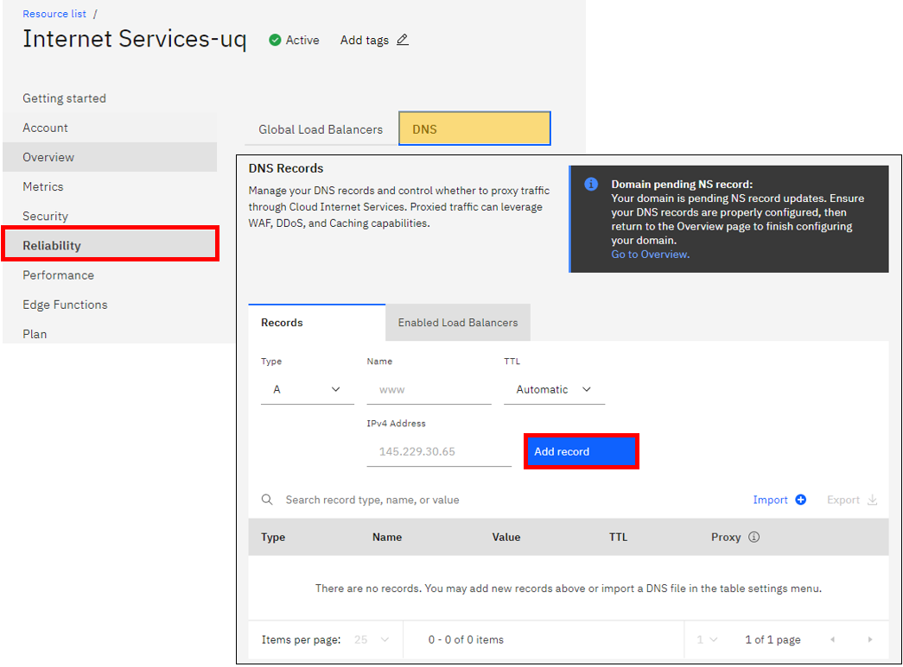

# IBM-Cloud-Internet-Services-

_Implementación de Cloud Internet Services en una aplicaación desplegada en una Instancia de VPC_

## Prerrequisitos 🛑 

Para esta Demo se requiere de conocimiento básico de DNS y redes.
Además de esto se requiere tener aprovisionado:
- [VPC.](https://cloud.ibm.com/docs/vpc?topic=vpc-getting-started)
- 2 [Instancias en la VPC](https://cloud.ibm.com/docs/vpc?topic=vpc-vsi_best_practices) con un servicion web configurado en ella.
- Configurar cada instancia como servidor de una misma aplicación
- [Listas de control de accesos](https://cloud.ibm.com/docs/vpc?topic=vpc-using-acls)

## Contenido 📋 
**_Instrucciones_**
Esta demo se divide en 4 factores importantes las cuales son:
- **Configuración de dominio y hostname**
- **Configuración de acceso al dominio**
- **Certificado SSL**
- **Certificado de origen**

Las diferentes configuraciones de esta demo se gestionan en diferentes servicios como **Cloud Internet Services**, **Virtual Private Cloud**, **Certificate Manager** e incluso la herramienta de **Access IAM**

## Comenzando 🚀 
### Configuración del dominio y el hostname
**Cloud Internet Services**
Para empezar, se debe crear un servicio de Internet Services, siguiendo las instrucciones del siguiente enlace:
- [Iniciación a IBM Cloud Internet Services](https://cloud.ibm.com/docs/cis?topic=cis-getting-started)

Luego de ello debe configurar un DNS reservado en el Internet Services creado previamente de la siguiente manera:
- Si ya se tiene un DNS reservado debe copiar los NS (Name Servers) y configurarlos dentro de Internet Services. Los NS tienen la siguiente estructura **ns#.provider.com**. Si tiene más de una deberá configurarlo en Internet Services como se muestra a continuación:
    1. Ingrese a la herramienta de Internet Services creada. Le va a aparecer el siguiente Dashboard:
    
     

    2. Al clickear en **Let´s start** aparecerá una pesataña lateral para conectar el dominio, configurar DNS record y delegar gestión del dominio, como se muestra a continuación:

     

    Una vez configurado el DNS reservado en la herramienta de Internet Service el estado del dominió aparecerá **pending** como se observa en la siguiente imagen:

     

    3. Para dejar el estado del dominio en Internet Services activo se debe configurar los **NS** antes mencionados en los records de Internet Services. Para ello, se debe dirigir a la pestaña de **Reliability** en la opción de **DNS**. Una vez allí, en la parte inferior de la ventana se encontraran los **Records** donde se configurarán los **NS** como se observa a continuación:

     

    Se debe llenar cada uno de los campos de **DNS Records** de la siguiente manera:
     - Type: NS
     - Name: @
     - TTL: Automatic
     - Name Server: **ns´s del DNS reservado**

    Una vez configurados los **Name Server** la conexión entre el DNS y el Internet Services tomará hasta 24 horas.

**VPC hostname - Load Balancer**
Para la configuración del hostname a la aplicación distribuida en las VSI´s, se requiere de la creación de un Load balancer para asignarle un único hostname a la aplicación.
Para aprovisionar el Load Balancer se debe dirigir al **VPC Infrastructure** en el menú principal de IBM Cloud y una vez allí debe ingresar al dashboard del Load balancer seleccionando **Load Balancer** en el menu de herramientas de VPC como se observa a continuación:

 

 [APIkey-ClassicInfrastructure](https://cloud.ibm.com/docs/iam?topic=iam-classic_keys&locale=es)

### Pasos para el despliegue en Schematics 🔧 

Se debe dirigir al simbolo de  en donde encontrará la opción de **Schematics** una vez alli se creará un nuevo workspace donde se contará con la siguiente pestaña:

En el espacio sobremarcado con rojo se debe pegar el link del repositorio y de ser necesario en la parte de abajo el Token para permisos de acceso. Se presiona el botón sobremarcado con amarillo para adquirir las variables a rellenar. Luego de rellenarlas se debe crear el workspace. En caso de realizar el procedimiento de forma correcta se contará con la siguiente pestaña:

Se debe generar el plan con el botón que aparece en pantalla y de generarse correctamente se podrá aplicar el plan. _Solo hasta aplicar el plan se va a generar facturación_

---
#### Autores: IBM Cloud Tech Sales
